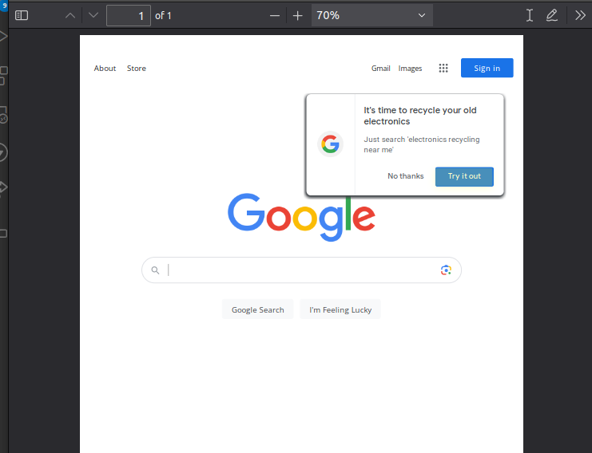

# @org-apis/html-to-pdf

HTMLtoPDF is a turn-key microservice that generates PDFs from HTML. It support
both URL and HTML based requests.

## Usage Example

```bash
curl -X POST https://nx7uv2rfy4.execute-api.us-east-2.amazonaws.com/default/v1/html-to-pdf/pdf -H "Content-Type: application/json" -d '{"input": "URL", "output": "PDF", "url": "https://google.com"}' -o example.pdf
```



## How it Works

PDF are generated using a headless version of Chromium running in a lambda. This
form of PDF rendering supports text recognition, images, hyperlinks, print media
queries, table breaks, and other features all this with relatively little code
maintenance.

This service address many finicky obstacles with making a request through API
gateway to a Lambda running Chromium to generate a PDF.

- NodeJS Lambda Layers do include default fonts files (\*.tff) like a standard
  OS does.
- Performance is essential and Lambda deploys are small. A compressed version of
  Chromium must be deployed independently as Lambda layer and for performance.
- API gateway if not properly configured to handle binary responses can cause a
  blank PDF.
- Serverless Express has to be configured to support the binary mime type.

## References

- [Generating PDF AWS Lambda](https://wavelop.com/en/story/generate-pdf-with-aws-lambda/)
- [Puppeteer Layers](https://github.com/RafalWilinski/serverless-puppeteer-layers/tree/master/layer)
- [Binary Lambda Responses](https://docs.aws.amazon.com/apigateway/latest/developerguide/api-gateway-payload-encodings-configure-with-console.html)
- [Serverless Express Binary](https://github.com/vendia/serverless-express/blob/master/examples/basic-starter/lambda.js)
