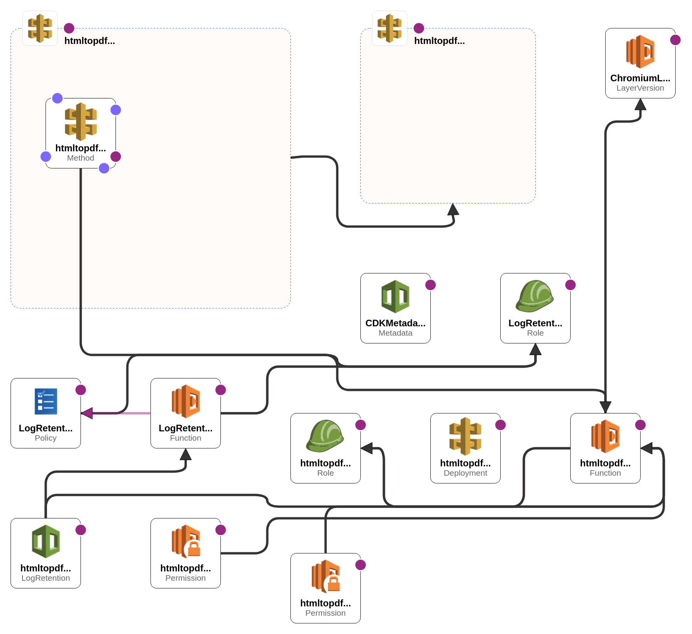

# @cats-cradle/html-to-pdf

[](https://badge.fury.io/js/@cats-cradle%2Fhtml-to-pdf)
[](LICENSE)
[](https://github.com/hxtree/cats-cradle/stargazers)



**Your Go-To Solution for PDF Generation from HTML.**

HTMLtoPDF is a high-performance microservice built to empower web developers
with a streamlined way to generate professional PDFs from HTML content. We
firmly believe that HTML, a language that's approachable for web development
beginners, should also be the preferred choice for most programmatic PDF
generation.

Tired of complex PDF libraries and clunky alternatives like FPDF or TCPDF?
HTMLtoPDF simplifies the entire process, making PDF generation a breeze. Say
goodbye to intricate code to exactly mimic browsers rendering of the page and
embrace a brighter future for PDF creation.

## Quick Start

Generating PDFs with HTMLtoPDF is as easy as pie. Just deploy service to AWS by
running command `cdk:deploy` and send request containing either a URL or HTML to
the API Gateway endpoint:

```bash
curl -X POST https://nx7uv2rfy4.execute-api.us-east-2.amazonaws.com/default/v1/html-to-pdf/pdf \
-H "Content-Type: application/json" \
-d '{"input": "URL", "output": "PDF", "url": "https://google.com"}' \
-o example.pdf
```

Output:


## How it Works

HTMLtoPDF employs a headless version of Chromium within an AWS Lambda
environment to seamlessly generate PDFs. This method supports a wide range of
features, including text recognition, images, hyperlinks, print media queries,
and table breaks, all with minimal code maintenance.

**Key Features**:

- **Default Fonts**: NodeJS Lambda Layers include default font files (\*.tff),
  ensuring compatibility similar to a standard OS.
- **Optimized Performance**: A compressed Chromium version is deployed as a
  separate Lambda layer for superior performance.
- **Binary Response Handling**: Our API gateway is meticulously configured to
  handle binary responses, eliminating the headache of blank PDFs.
- **Serverless Express Support**: Serverless Express is pre-configured to
  support binary mime types seamlessly.

## References

To dive deeper into HTMLtoPDF problem space, explore the following resources:

- [Generating PDF with AWS Lambda](https://wavelop.com/en/story/generate-pdf-with-aws-lambda/)
- [Puppeteer Layers](https://github.com/RafalWilinski/serverless-puppeteer-layers/tree/master/layer)
- [Configuring Binary Lambda Responses](https://docs.aws.amazon.com/apigateway/latest/developerguide/api-gateway-payload-encodings-configure-with-console.html)
- [Serverless Express Binary Configuration](https://github.com/vendia/serverless-express/blob/master/examples/basic-starter/lambda.js)
